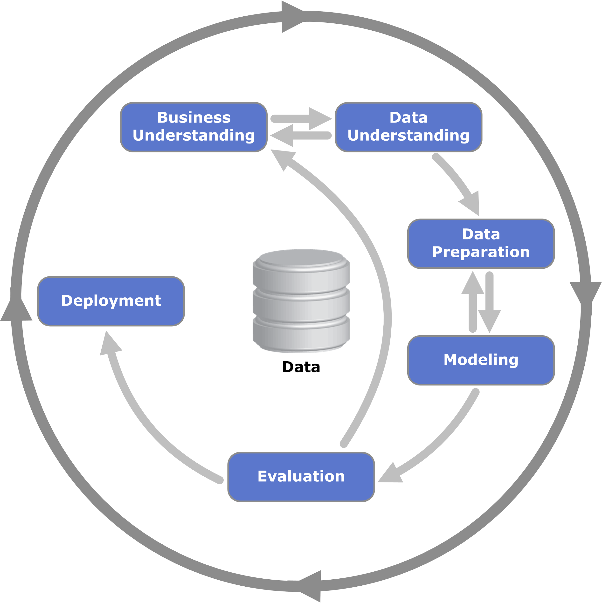

# Introdução

Este trabalho é o resultado de uma investigação dos Programas de Pós Graduação sugeridos na disciplina de Tópicos Avançados em Computadores, Turma D, onde o principal foco é a Ciência de Dados. Como Metodologia, o atual projeto adota o CRISP-DM, que é um modelo orientado na solução de problemas de Mineração de Dados.

## O que é Ciência?

A ciência se caracteriza pela busca de conhecimento sistemático, isto é, organizado, ordenado, metódico e seguro dos fenômenos do mundo. Um dos objetivos básicos da ciência é, tornar o mundo compreensível, proporcionando ao homem, um meio de exercer o controle sobre a natureza. Assim, se desenvolve uma visão positiva da ciência.

Objetivos de uma pesquisa:

* Fazer uma contribuição inovadora para a Ciência  
* Deve responder a uma pergunta – de interesse para a comunidade científica – ainda não respondida anteriormente – de relevância para o interesse social (caso de tecnologia)  A parte mais difícil é: – achar a pergunta certa !

O método científico pode ser definido como um conjunto de procedimentos por meio dos quais um cientista consegue propor um conjunto de explicações para fenômenos, constituição e formação de materiais etc. De forma geral, o método científico pode apresentar as seguintes etapas:

1. **Observação:** É a etapa em que o pesquisador observa uma determinada matéria ou fenômeno.

2. **Elaboração do problema (fase do questionamento):**  Nessa etapa, o cientista ou pesquisador elabora perguntas sobre o fenômeno ou material analisado, tais como: Por que esse fenômeno ocorre? Como esse fenômeno ocorre? Quais são os fatores que originaram esse fenômeno? Qual é a composição do material? Que substâncias formam esse material? Qual é a importância desse material?

3.  **Hipóteses:** É a etapa em que o pesquisador responde às perguntas feitas na etapa anterior. Essas respostas podem ser pautadas em seu conhecimento prévio sobre materiais ou fenômenos semelhantes. A elaboração das hipóteses deve ser feita com muita cautela porque é por meio delas que a fase da experimentação será realizada, ou seja, elas serão o ponto de partida da experimentação.

4. **Experimentação:** Nessa etapa, experimentos e pesquisas bibliográficas são realizados com base nas hipóteses levantadas. O objetivo é encontrar a resposta para cada um dos questionamentos que foram elaborados. Cada cientista desenvolve essa etapa de acordo com os conhecimentos que possui e as práticas que são necessárias para o esclarecimento de cada hipótese.

5. **Análise dos resultados:** Após a fase da experimentação, o pesquisador analisa cada um dos resultados para verificar se eles são suficientes para explicar cada um dos problemas levantados e também se estão de acordo com as hipóteses. Caso os resultados não sejam satisfatórios, novas hipóteses podem ser levantadas para que novas experimentações ocorram. 

6. **Conclusão:** A conclusão é a etapa em que o cientista verifica se os experimentos e pesquisas realizados respondem aos questionamentos levantados e permitem que ele faça afirmações acerca dos fenômenos ou materiais analisados.

## Ciências no Brasil

Muitas inciativas ciêntificas existiram, porem sem obter grande exito. Foi somente no período pos guerra que se foi descutido a importância estratégica do desenvolvimento técnologico e estabelico leis de incentivo e investimento ao desenvolvimento técnologico nacional. 

No segundo pós-guerra, o Brasil conheceria uma ampliação de sua base industrial e o surgimento de um debate sobre a política científica. As questões candentes da realização da independência e do desenvolvimento econômico nacional exigiriam a autonomia tecnológica e a criação de pólos de ciência. Em 1947, inseriu-se na constituição estadual paulista o percentual de 0,5% da arrecadação para a pesquisa científica (aumentada para 1% na constituição estadual de 1989). A comunidade científica começa sua articulação representativa com a criação da SBPC (Sociedade Brasileira para o Progresso da Ciência), em 1948 (entre outros, por José Reis e Maurício Rocha e Silva), a partir da decisão do governador de São Paulo Adhemar de Barros limitar a atividade do Instituto Butantã à produção de soros antiofídicos. A revista Ciência e Cultura, lançada em abril de 1949, será seguida, no mês de outubro, da primeira reunião, em Campinas com 104 participantes. Na década de 50, a SBPC terá importante papel na discussão da LDB Lei de Diretrizes e Bases da Educação, e numa polêmica com o governo federal acerca da necessidade de uma política científica que estimulasse a ciência básica, além da aplicada. Em 15/01/1951 é criado o Conselho Nacional de Pesquisas, e seu primeiro presidente foi o vice-almirante Álvaro Alberto da Motta e Silva Um marco para a física no Brasil é a constituição, em 1949, do Centro Brasileiro de Pesquisas Físicas, dirigido por Cesar Lattes, que irá realizar pesquisas sobre raios cósmicos na Bolívia e estudos pioneiros sobre o méson pi artificial. **Carneiro (2005)**

**Tipos de pesquisa**

* **Exploratória** 
A pesquisa exploratória procura explorar um problema, de modo a fornecer informações para uma investigação mais precisa.
Elas visam uma maior proximidade com o tema, que pode ser construído com base em hipóteses ou intuições. 
É onde pesquisadores tentam explicar o que está acontecendo.

  + **Objetivo** Descobrir ideias e pensamentos.

  + **Processo** Não estruturado

  + **Dados** Qualitativo
  
  + **Coleta de dados** Pesquisas bibliográficas e estudos de caso são muito utilizados nas pesquisas exploratórias.

* **Descritiva**
A pesquisa descritiva visa descrever algo. Para isso, é feita uma análise minuciosa e descritiva do objeto de estudo. Essa pesquisa não pode ter interferência do pesquisador.

  + **Objetivo** Descrever características e funções.

  + **Processo** Estruturado

  + **Dados** Quantitativo
  
  + **Coleta de dados** Apesar de também investirem na coleta e no levantamento de dados qualitativos, utiliza-se principalmente dados quantitativos.


* **Explicativa** A pesquisa explicativa é uma tentativa de conectar as ideias e fatores identificados para compreender as causas e efeitos de determinado fenômeno.

  + **Objetivo** Compreender causas e efeitos.

  + **Processo** Estruturado

  + **Dados** Quantitativo
  
  + **Coleta de dados** Baseada em métodos experimentais.

# CRISP-DM

O atual projeto adota como Metodologia o CRISP-DM (Processo Padrão de Vários Segmentos de Mercados para Mineração de Dados), que é um modelo e metodologia que busca orientar os esforços da organização descrevendo as fases típicas e tarefas envolvidas do ciclo de vida em um projeto de mineração de dados (IBM, 2015). Acompanhe na Figura 1 abaixo o fluxograma padrão que representa uma visão geral das fases do CRISP-DM.


```{r, out.width = "200px", fig.align = "center", fig.cap="O ciclo de vida da mineração de dados. Fonte: IBM (2015, pág. 1)"}

```


Como é possível observar, O CRISP-DM é um modelo composto por seis fases, estas, estão descritas abaixo:


* Business Understanding - Entendimento de Negócios: Trata-se da fase inicial do projeto, onde se investiga as metas de negócios da organização, reúne-se informações básicas e define critérios para o sucesso.

* Data Understanding - Entendimento dos Dados: Etapa de verificação dos dados disponíveis a fim de evitar problemas posteriores. Normalmente, esta é a etapa mais longa de um projeto (IBM, 2015).

* Data Preparation - Preparação de Dados: “Estima-se que a preparação de dados normalmente consome 50-70% do tempo e esforço do projeto”(IBM, 2015, p. 19). 

* Modeling - Modelando: Nesta fase, o problema, as metas definidas no Entendimento de Negócios e os dados disponíveis definem as técnicas de modelagem a serem utilizadas. Estima-se que esta etapa seja realizada em várias iterações. Primeiramente, com os hiperparâmetros padrão e, nas iterações seguintes, refinando-os a fim de buscar por resultados cada vez mais satisfatórios.

* Evaluation - Avaliação: Fase onde se analisa e faz inferências sobre os esforços realizado. Para que seja possível cumprir esta etapa de forma objetiva, critérios de avaliação são estabelecidos para os modelos.

* Deployment - Implantação: Esta fase inclui o planejamento e monitoramento da implantação, além de tarefas de finalização, como produção do relatório final e revisão do projeto (IBM, 2015)


# Execução

## Entendimento de Negócios

### Ensino de Matemática (33002010223P9)


O programa é um curso de pós-graduação do IME que se enquadra na modalidade de Mestrado, que confere à CAPES as atribuições de regular a oferta para propostas de tais cursos e avaliá-las. Recebeu nota 4 na avaliação prévia dessa instituição de fomento e teve início em agosto de 2012.

Este programa é um de modalidade profissional, diferente dos outros programas de pós-graduação da USP. Foi iniciado em 2012 e teve as primeiras dissertações defendidas em 2014 e 2015.

A finalidade do programa é a formação continuada em nível de pós-graduação de professores de Matemática do Ensino Básico. De nítido caráter público, o Mestrado Profissional em Ensino de Matemática é gratuito, em conformidade com o Regimento da Pós-Graduação da USP.

| Curso | Nota do curso | Créditos em disciplinas | Créditos em trabalhos de conclusão para titulação | Equivalência hora-aula/créditos | Código |
|:-----:|:-------------:|:-----------------------:|:-------------------------------------------------:|:-------------------------------:|:-------------:|
| M | 4 | 48 | 48 | 15 | 33002010223F1 |

| Discentes | 78 |
|:--------------------:|:--:|
| Docentes | 29 |
| Linhas de pesquisa | 1 |
| Disciplinas | 15 |
| Projetos de Pesquisa | 12 |

O programa oferece as seguintes áreas de pesquisa:

* Tecnologias de Informática no Ensino de Matemática ou Estatística
* História da Matemática no Ensino Básico
* Transposição didática da Matemática para a sala de aula escolar
* Epistemologia da Matemática e Educação Básica
* Estatística no ensino fundamental e médio


###  Matemática (33002010005P1)

O Programa de Pós Graduação em Matemática (33002010005P1) do Instituto de de Estatística da USP é constituído por um curso de mestrado, iniciado em 1970. Acompanhe abaixo algumas informações extraídas da plataforma Sucupira:

| Curso | Nota do curso | Créditos em disciplinas | Créditos em trabalhos de conclusão para titulação | Equivalência hora-aula/créditos | Código |
|:-----:|:-------------:|:-----------------------:|:-------------------------------------------------:|:-------------------------------:|:-------------:|
| M | 5 | 48 | 48 | 15 | 33002010005M1 |
| D | 5 | 48 | 128 | 15 | 33002010005D2 |


| Discentes | 132 |
|:--------------------:|:--:|
| Docentes | 61 |
| Linhas de pesquisa | 4 |
| Disciplinas | 152 |
| Projetos de Pesquisa | 89 |

De acordo com o site do Instituto de Matemática e Estatística (IME) da USP, o Programa está estruturado a partir de suas linhas de pesquisa e projetos e de suas áreas de concentração citadas abaixo. Cada área possui:

* Álgebra,
* Análise e Sistemas Dinâmicos,
* Geometria e Topologia Algébrica,
* Lógica, Conjuntos, Topologia geral e Combinatória.


### Matemática Aplicada (33002010006P8)

O programa foi criado em 1970 para mestrado e doutorado. Sua única área de concentração é matemática aplicada. O programa conta com 5 linhas de pesquisa e 17 projetos de pesquisa. O programa permite a integração com outros programas do Instituto de Matemática e Estatística. Seu financiamento é feito por meio do CNPq, CAPES e FAPESP. Ambos os programas obtiveram nota 5 em todas as avaliações desde 1998. Com exceção dos anos de 2013 e 2014, quando obtiveram nota 4.

| Curso | Nota do curso | Créditos em disciplinas | Créditos em trabalhos de conclusão para titulação | Equivalência hora-aula/créditos | Código |
|:-----:|:-------------:|:-----------------------:|:-------------------------------------------------:|:-------------------------------:|:-------------:|
| M | 5 | 48 | 55 | 15 | 33002010006M8 |
| D | 5 | 40 | 136 | 15 | 33002010006D9 |

| Discentes | 110 |
|:--------------------:|:---:|
| Docentes | 35 |
| Linhas de pesquisa | 5 |
| Disciplinas | 73 |
| Projetos de Pesquisa | 17 |


O programa oferece as seguintes áreas de pesquisa:

* Equações Diferenciais e Aplicações
  + Dinâmica de Equações de Evolução
  + Dinâmica de Sistemas Hamiltonianos
  + Equações Diferenciais Parciais não Lineares
  + Mecânica Geométrica e Controle
  + Teoria Geométrica de EDPs e várias variáveis complexas
  + Teoria Qualitativa das Equações Diferenciais e suas Aplicações

* Física Matemática
  + Mecânica Estatística Rigorosa: Clássica e Quântica
  + Teoria Clássica e Quântica dos Campos

* Matemática Aplicada Computacional
  + Computação Gráfica
  + Métodos Numéricos e Mecânica dos Fluidos Computacional
  + Métodos Numéricos e Otimização

* Modelagem Matemática e Aplicações
  + Estatística Bayesiana, Otimização Estocástica e Sistemas Esparsos
  + Modelos Matemáticos Aplicados à Epidemiologia
  + Modelos Matemáticos em Genética
  + Modelos Matemáticos para Sistemas Sociais

* Sistemas Dinâmicos
  + Dinâmica e Geometria em Baixas Dimensões
  + Teoria Ergódica: Otimização Ergódica e Formalismo Termodinâmico
  
  
  
## Entendimento dos dados

  Os dados utilizados neste projeto foram obtidos com o auxílio da ferramenta e-lattes. Nela, é possível gerar análise dos programas de graduação a partir da lista de pesquisadores envolvidos. Para o atual projeto, foram utilizados três arquivos .csv contendo os nomes e ids dos pesquisadores dos três programas de graduação citados no capítulo anterior (Ensino de Matemática, Matemática e Matemática aplicada, da USP). EM seguida, essas listas foram processadas na plataforma, que retornou os arquivos .json que servirão de insumo para todas as análises realizadas.
  Os arquivos possuem informações sobre os pesquisadores, as publicações e as orientações. A fim de obtermos uma maior compreensão sobre os dados a serem manipulados e analisados.

## Preparação dos dados


* Importando bibliotecas
```{r message=FALSE, warning=FALSE}
library(jsonlite) #Importado para lidar com arquivos com extensão JSON
library(listviewer) #Importado para lidar com listas
library(ggplot2) #Importado para realizar visualizações
library(tidyr) #Importado par utilizar funções relacionadas a dataframes
library(dplyr)
library(readxl)
library(stringr)
library(tidyverse)
library(listviewer)
library(igraph)
#upload de arquivo com funções para transformar listas em Data Frames e objeto igraph
source("elattes.ls2df.R") #Métodos do arquivo "elattes.ls2df.R" também foi utilizado na transformação de algumas listas em dataframes. 
```


* Importando os datasets dos 3 programas de pós graduação
```{r}
perfil_ens <- fromJSON("./Ensino de Matemática (33002010223P9)/profile.json")
public_ens <- fromJSON("./Ensino de Matemática (33002010223P9)/publication.json")
advise_ens <- fromJSON("./Ensino de Matemática (33002010223P9)/advise.json")


perfil_mat <- fromJSON("./Matemática (33002010005P1)/profile.json")
public_mat <- fromJSON("./Matemática (33002010005P1)/publication.json")
advise_mat <- fromJSON("./Matemática (33002010005P1)/advise.json")

perfil_apl <- fromJSON("./MATEMÁTICA APLICADA (33002010006P8)/profile.json")
public_apl <- fromJSON("./MATEMÁTICA APLICADA (33002010006P8)/publication.json")
advise_apl <- fromJSON("./MATEMÁTICA APLICADA (33002010006P8)/advise.json")

```

* Número de pesquisadores
```{r}
print(paste('Ensino de Matemática =', length(perfil_ens)))
print(paste('Matemática =', length(perfil_mat)))
print(paste('Matemática Aplicada =', length(perfil_apl)))
```

Como é possível, observar, o programa de Matemática possui um número bem maior de pesquisadores. Esses dados são refletidos em outros índices como número de trabalhos publicados e quantidade de especializações, onde o programa de Matemática também tem um valor acima dos outros. Esse valor também reflete a quantidade de discentes no programa: Ensino de Matemática 78, Matemática 132 e Matemática aplicada 110.

* Exemplo de pesquisador do arquivo profile.json
```{r}
glimpse(perfil_ens[["0348490713417429"]])

```

* Primeiro nível dos arquivos public.json
```{r}
names(public_ens)
```

* Primeiro nível dos arquivos advise.json

```{r}
names(advise_ens)
```

* Exemplo de conteúdo no glimpse no ano 2012 de orientaçao de doutorado em andamento

```{r}
glimpse(advise_apl[["ORIENTACAO_EM_ANDAMENTO_DOUTORADO"]][["2012"]])
```


## Modelagem

## Avaliação


### Pesquisadores por grande área

* Ensino de Matemática
```{r}
perfil_ens %>% 
  sapply(function(x) unique(x$areas_de_atuacao$grande_area)) %>% 
  unlist() %>% table() %>% sort() %>% as.data.frame() %>% filter(!. == "") %>% 
  ggplot(aes(x = ., y = Freq)) + geom_col(fill = "green4",alpha=0.8,width=0.8) + coord_flip() + geom_text(aes(label=Freq),hjust=-0.2,vjust=0.5,size=3.5) +
  labs(title = "Número de Pessoas por Grande Área Atuação", y="Quantidade",x="Grande Área") + theme_bw() + scale_y_continuous()+
  scale_x_discrete(labels = c('CIENCIAS_DA_SAUDE' = 'Ciências da Saúde',
                              'CIENCIAS_BIOLOGICAS' = 'Ciências Biológicas',
                              'CIENCIAS_HUMANAS' = 'Ciências Humanas',
                              "CIENCIAS_EXATAS_E_DA_TERRA" = "Ciências Exatas e da Terra",
                              "CIENCIAS_SOCIAIS_APLICADAS" = "Ciências Sociais Aplicadas",
                              "CIENCIAS_AGRARIAS" = "Ciências Agrárias",
                              "OUTROS" = "Outros",
                              "ENGENHARIAS" = "Engenharias",
                              "LINGUISTICA_LETRAS_E_ARTES" = "Linguística, Letras e Artes"))
```

* Matemática
```{r}
perfil_mat %>% 
  sapply(function(x) unique(x$areas_de_atuacao$grande_area)) %>% 
  unlist() %>% table() %>% sort() %>% as.data.frame() %>% filter(!. == "") %>% 
  ggplot(aes(x = ., y = Freq)) + geom_col(fill = "green4",alpha=0.8,width=0.8) + coord_flip() + geom_text(aes(label=Freq),hjust=-0.2,vjust=0.5,size=3.5) +
  labs(title = "Número de Pessoas por Grande Área Atuação", y="Quantidade",x="Grande Área") + theme_bw() + scale_y_continuous()+
  scale_x_discrete(labels = c('CIENCIAS_DA_SAUDE' = 'Ciências da Saúde',
                              'CIENCIAS_BIOLOGICAS' = 'Ciências Biológicas',
                              'CIENCIAS_HUMANAS' = 'Ciências Humanas',
                              "CIENCIAS_EXATAS_E_DA_TERRA" = "Ciências Exatas e da Terra",
                              "CIENCIAS_SOCIAIS_APLICADAS" = "Ciências Sociais Aplicadas",
                              "CIENCIAS_AGRARIAS" = "Ciências Agrárias",
                              "OUTROS" = "Outros",
                              "ENGENHARIAS" = "Engenharias",
                              "LINGUISTICA_LETRAS_E_ARTES" = "Linguística, Letras e Artes"))
```


*  Matemática Aplicada
```{r}
perfil_apl %>% 
  sapply(function(x) unique(x$areas_de_atuacao$grande_area)) %>% 
  unlist() %>% table() %>% sort() %>% as.data.frame() %>% filter(!. == "") %>% 
  ggplot(aes(x = ., y = Freq)) + geom_col(fill = "green4",alpha=0.8,width=0.8) + coord_flip() + geom_text(aes(label=Freq),hjust=-0.2,vjust=0.5,size=3.5) +
  labs(title = "Número de Pessoas por Grande Área Atuação", y="Quantidade",x="Grande Área") + theme_bw() + scale_y_continuous()+
  scale_x_discrete(labels = c('CIENCIAS_DA_SAUDE' = 'Ciências da Saúde',
                              'CIENCIAS_BIOLOGICAS' = 'Ciências Biológicas',
                              'CIENCIAS_HUMANAS' = 'Ciências Humanas',
                              "CIENCIAS_EXATAS_E_DA_TERRA" = "Ciências Exatas e da Terra",
                              "CIENCIAS_SOCIAIS_APLICADAS" = "Ciências Sociais Aplicadas",
                              "CIENCIAS_AGRARIAS" = "Ciências Agrárias",
                              "OUTROS" = "Outros",
                              "ENGENHARIAS" = "Engenharias",
                              "LINGUISTICA_LETRAS_E_ARTES" = "Linguística, Letras e Artes"))
```

A quantidade de pessoas por grande área de atuação nos mostra uma grande concentração de pessoas em Ciências Exatas e da Terra como era de se esperar ao avaliar os cursos de matemática: Ensino de Matemática 79,41%, Matemática 98,28% e Matemática Aplicada 94,59%. Pelo fato do programa de Ensino de Matemática ter uma parte voltada ao ensino, ele tem uma concentração maior que os outros programas em Ciências Humanas 20,59%. E o programa de Matemática Aplicada tem um contato, ainda que pequeno, com Engenharias 5,41%.


### Distribuição dos pesquisadores por área de atuação

* Ensino de Matemática

```{r}
areas_atuacao_ens <- perfil_ens%>% 
  sapply(function(x) unique(x$areas_de_atuacao$area)) %>% 
  unlist() %>% table() %>% sort(decreasing = TRUE) %>% 
  as.data.frame() %>% filter(!. == "")

quantidade <- sum(areas_atuacao_ens$Freq)
areas_atuacao_ens <- mutate(areas_atuacao_ens, percent = round(areas_atuacao_ens$Freq/quantidade * 100, 0))

colnames(areas_atuacao_ens) <- c("Areas", "Quantidade", "Porcentagem")

ggplot(areas_atuacao_ens, aes(x="", y=Quantidade, fill=Areas))+
  geom_bar(width = 1, stat = "identity") + 
  coord_polar("y", start = 0, direction = -1) +
  geom_text(data = areas_atuacao_ens, 
            aes(x ="", y=Quantidade, label = paste(Porcentagem, "%")),
            position = position_stack(vjust = 0.5))
```

* Matemática

```{r}
areas_atuacao_mat <- perfil_mat%>% 
  sapply(function(x) unique(x$areas_de_atuacao$area)) %>% 
  unlist() %>% table() %>% sort(decreasing = TRUE) %>% 
  as.data.frame() %>% filter(!. == "")

quantidade <- sum(areas_atuacao_mat$Freq)
areas_atuacao_mat <- mutate(areas_atuacao_mat, percent = round(areas_atuacao_mat$Freq/quantidade * 100, 0))

colnames(areas_atuacao_mat) <- c("Areas", "Quantidade", "Porcentagem")

ggplot(areas_atuacao_mat, aes(x="", y=Quantidade, fill=Areas))+
  geom_bar(width = 1, stat = "identity") + 
  coord_polar("y", start = 0, direction = -1) +
  geom_text(data = areas_atuacao_mat, 
            aes(x ="", y=Quantidade, label = paste(Porcentagem, "%")),
            position = position_stack(vjust = 0.5))
```

* Matemática Aplicada

```{r}
areas_atuacao_apl <- perfil_apl%>% 
  sapply(function(x) unique(x$areas_de_atuacao$area)) %>% 
  unlist() %>% table() %>% sort(decreasing = TRUE) %>% 
  as.data.frame() %>% filter(!. == "")

quantidade <- sum(areas_atuacao_apl$Freq)
areas_atuacao_apl <- mutate(areas_atuacao_apl, percent = round(areas_atuacao_apl$Freq/quantidade * 100, 0))

colnames(areas_atuacao_apl) <- c("Areas", "Quantidade", "Porcentagem")

ggplot(areas_atuacao_apl, aes(x="", y=Quantidade, fill=Areas))+
  geom_bar(width = 1, stat = "identity") + 
  coord_polar("y", start = 0, direction = -1) +
  geom_text(data = areas_atuacao_apl, 
            aes(x ="", y=Quantidade, label = paste(Porcentagem, "%")),
            position = position_stack(vjust = 0.5))
```

A quantidade de pesquisadores atuando na área de Educação é discrepante na pós de Ensino de Matemática em comparação com os outros programas analisados. Este resultado é convergente com o previsto, dada a natureza do programa em questão.


### Distribuição dos pesquisadores por especialidade (as 7 mais frequentes)

* Ensino de Matemática
```{r}
especialidades_frequentes <- perfil_ens%>% 
  sapply(function(x) unique(x$areas_de_atuacao$especialidade)) %>% 
  unlist() %>% table() %>% sort(decreasing = TRUE) %>% 
  as.data.frame() %>% filter(!. == "") %>% head(7) 

quantidade <- sum(especialidades_frequentes$Freq)

especialidades_frequentes <- mutate(especialidades_frequentes, percent = round(especialidades_frequentes$Freq/quantidade * 100, 0))

colnames(especialidades_frequentes) <- c("Especialidade", "Quantidade", "Porcentagem")

ggplot(especialidades_frequentes, aes(x="", y=Quantidade, fill=Especialidade))+
  geom_bar(width = 1, stat = "identity") + 
  #coord_polar("y", start = 0, direction = -1) +
  geom_text(data = especialidades_frequentes, 
            aes(x ="", y=Quantidade, label = Quantidade),
            position = position_stack(vjust = 0.5))

```


* Matemática
```{r}
especialidades_frequentes <- perfil_mat%>% 
  sapply(function(x) unique(x$areas_de_atuacao$especialidade)) %>% 
  unlist() %>% table() %>% sort(decreasing = TRUE) %>% 
  as.data.frame() %>% filter(!. == "") %>% head(7) 

quantidade <- sum(especialidades_frequentes$Freq)

especialidades_frequentes <- mutate(especialidades_frequentes, percent = round(especialidades_frequentes$Freq/quantidade * 100, 0))

colnames(especialidades_frequentes) <- c("Especialidade", "Quantidade", "Porcentagem")

ggplot(especialidades_frequentes, aes(x="", y=Quantidade, fill=Especialidade))+
  geom_bar(width = 1, stat = "identity") + 
  #coord_polar("y", start = 0, direction = -1) +
  geom_text(data = especialidades_frequentes, 
            aes(x ="", y=Quantidade, label = Quantidade),
            position = position_stack(vjust = 0.5))

```


* Matemática Aplicada
```{r}
especialidades_frequentes <- perfil_apl%>% 
  sapply(function(x) unique(x$areas_de_atuacao$especialidade)) %>% 
  unlist() %>% table() %>% sort(decreasing = TRUE) %>% 
  as.data.frame() %>% filter(!. == "") %>% head(7) 

quantidade <- sum(especialidades_frequentes$Freq)

especialidades_frequentes <- mutate(especialidades_frequentes, percent = round(especialidades_frequentes$Freq/quantidade * 100, 0))

colnames(especialidades_frequentes) <- c("Especialidade", "Quantidade", "Porcentagem")

ggplot(especialidades_frequentes, aes(x="", y=Quantidade, fill=Especialidade))+
  geom_bar(width = 1, stat = "identity") + 
  #coord_polar("y", start = 0, direction = -1) +
  geom_text(data = especialidades_frequentes, 
            aes(x ="", y=Quantidade, label = Quantidade),
            position = position_stack(vjust = 0.5))
```

Como foi possível observar as especialidades mais frequêntes nos programas de Ensino de Matemática e Matemática são sistemas dinâmicos, equações diferenciais ordinárias e análise funcional. O programa de Matemática aplicada diverge um pouco dos demais nas especialidades mais frequentes. O de Ensino de matemática conta com a especialidade de tecnologia educacional que não aparece nos outros programas.

### Subáreas mais frequentes

* Ensino de Matemática

```{r}
subarea <- perfil_ens %>% 
  sapply(function(x) (x$areas_de_atuacao$sub_area)) %>% 
  unlist() %>% table() %>% 
  sort(decreasing = TRUE) %>%   as.data.frame() %>% 
  filter(!. == "") %>% head(5)

quantidade <- sum(subarea$Freq)

subarea <- mutate(subarea, percent = round(subarea$Freq/quantidade * 100, 0))

colnames(subarea) <- c("Subarea", "Quantidade", "Porcentagem")

ggplot(subarea, aes(x="", y=Quantidade, fill=Subarea))+
  geom_bar(width = 1, stat = "identity") + 
  coord_polar("y", start = 0, direction = -1) +
  geom_text(data = subarea, 
            aes(x ="", y=Quantidade, label = paste(Porcentagem, "%")),
            position = position_stack(vjust = 0.5))


```

* Matemática

```{r}
subarea <- perfil_mat %>% 
  sapply(function(x) (x$areas_de_atuacao$sub_area)) %>% 
  unlist() %>% table() %>% 
  sort(decreasing = TRUE) %>%   as.data.frame() %>% 
  filter(!. == "") %>% head(5)

quantidade <- sum(subarea$Freq)

subarea <- mutate(subarea, percent = round(subarea$Freq/quantidade * 100, 0))

colnames(subarea) <- c("Subarea", "Quantidade", "Porcentagem")

ggplot(subarea, aes(x="", y=Quantidade, fill=Subarea))+
  geom_bar(width = 1, stat = "identity") + 
  coord_polar("y", start = 0, direction = -1) +
  geom_text(data = subarea, 
            aes(x ="", y=Quantidade, label = paste(Porcentagem, "%")),
            position = position_stack(vjust = 0.5))
```

* Matemática Aplicada

```{r}
subarea <- perfil_apl %>% 
  sapply(function(x) (x$areas_de_atuacao$sub_area)) %>% 
  unlist() %>% table() %>% 
  sort(decreasing = TRUE) %>%   as.data.frame() %>% 
  filter(!. == "") %>% head(5)

quantidade <- sum(subarea$Freq)

subarea <- mutate(subarea, percent = round(subarea$Freq/quantidade * 100, 0))

colnames(subarea) <- c("Subarea", "Quantidade", "Porcentagem")

ggplot(subarea, aes(x="", y=Quantidade, fill=Subarea))+
  geom_bar(width = 1, stat = "identity") + 
  coord_polar("y", start = 0, direction = -1) +
  geom_text(data = subarea, 
            aes(x ="", y=Quantidade, label = paste(Porcentagem, "%")),
            position = position_stack(vjust = 0.5))
```


Ao analisar as subárias mais frequentes dos programas de graduação, é possível notar a presença constante da subárea "Ánálise", sendo a mais frequente em dois dos três programas. Observando as principais diferenças entre os programas, Ensino de Matemática é o único que apresenta a "Ensino-Aprendizagem", enquanto Matemática aplicada é o único com "Física Geral".


### Total de publicações em Periódicos

* Ensino de Matemática
```{r}
sum(sapply(public_ens$PERIODICO, function(x) length(x$natureza)))
```
* Matemática
```{r}
sum(sapply(public_mat$PERIODICO, function(x) length(x$natureza)))
```
* Matemática Aplicada
```{r}
sum(sapply(public_apl$PERIODICO, function(x) length(x$natureza)))
```

Considerando que o programa Ensino de Matemática não se trata de um mestrado academico, já é esperado que o número de suas publicações tenha menor comparado aos outros programas.
Ainda existe uma grande discrepãncia entre os artigos publicados pelo programa Matemática e Matemática aplicada. Porém a narureza do programa Matemática Aplicada está em desenvolvimento não necessário academico para artigos.

### Cinco revistas mais publicadas

* Ensino de Matemática
```{r}
head(sort(table(as.data.frame(unlist
  (sapply(public_ens$PERIODICO, function(x) unlist(x$periodico)))
  )), decreasing = TRUE),5)
```
* Matemática
```{r}
head(sort(table(as.data.frame(unlist
  (sapply(public_mat$PERIODICO, function(x) unlist(x$periodico)))
  )), decreasing = TRUE),5)
```
* Matemática Aplicada
```{r}
head(sort(table(as.data.frame(unlist
  (sapply(public_apl$PERIODICO, function(x) unlist(x$periodico)))
  )), decreasing = TRUE),5)
```


### Número de eventos por ano

* Ensino de Matemática
```{r}
public.eventos.df <- pub.ls2df(public_ens, 5)
public.eventos.df %>%
  group_by(ano_do_trabalho) %>%
  summarise(Quantidade = n()) %>%
  ggplot(aes(x = ano_do_trabalho, y = Quantidade)) +
  geom_bar(position = "stack",stat = "identity", fill = "darkcyan")+
  geom_text(aes(label=Quantidade), vjust=-0.3, size=2.5)+
  theme_minimal()
```
* Matemática
```{r}
public.eventos.df <- pub.ls2df(public_mat, 5)
public.eventos.df %>%
  group_by(ano_do_trabalho) %>%
  summarise(Quantidade = n()) %>%
  ggplot(aes(x = ano_do_trabalho, y = Quantidade)) +
  geom_bar(position = "stack",stat = "identity", fill = "darkcyan")+
  geom_text(aes(label=Quantidade), vjust=-0.3, size=2.5)+
  theme_minimal()
```
* Matemática Aplicada
```{r}
public.eventos.df <- pub.ls2df(public_apl, 5)
public.eventos.df %>%
  group_by(ano_do_trabalho) %>%
  summarise(Quantidade = n()) %>%
  ggplot(aes(x = ano_do_trabalho, y = Quantidade)) +
  geom_bar(position = "stack",stat = "identity", fill = "darkcyan")+
  geom_text(aes(label=Quantidade), vjust=-0.3, size=2.5)+
  theme_minimal()
```

Fazendo uma comparação geral, nota-se que o programa de Ensino de Matemática possui um número geral maior de eventos em relação aos outros programas, mesmo não sendo o que possui mais pesquisadores. No ano em que há o menor número de eventos, 2013, quando foram realizados 17 eventos, ainda assim é uma quantidade maior do que os anos de mais eventos dos outros programas . Portando, podemos concluir a partir desses gráficos que este programa enfatiza a realização de eventos.

### Número de publicações por ano

* Ensino de Matemática

```{r}
public.periodico.df <- pub.ls2df(public_ens, 1)
public.periodico.df %>%
  group_by(ano) %>%
  summarise(Quantidade = n()) %>%
  ggplot(aes(x = ano, y = Quantidade)) +
  geom_bar(position = "stack",stat = "identity", fill = "darkcyan")+
  geom_text(aes(label=Quantidade), vjust=-0.3, size=2.5)+
  theme_minimal()
```

* Matemática

```{r}
public.periodico.df <- pub.ls2df(public_mat, 1)
public.periodico.df %>%
  group_by(ano) %>%
  summarise(Quantidade = n()) %>%
  ggplot(aes(x = ano, y = Quantidade)) +
  geom_bar(position = "stack",stat = "identity", fill = "darkcyan")+
  geom_text(aes(label=Quantidade), vjust=-0.3, size=2.5)+
  theme_minimal()
```

* Matemática Aplicada

```{r}
public.periodico.df <- pub.ls2df(public_apl, 1)
public.periodico.df %>%
  group_by(ano) %>%
  summarise(Quantidade = n()) %>%
  ggplot(aes(x = ano, y = Quantidade)) +
  geom_bar(position = "stack",stat = "identity", fill = "darkcyan")+
  geom_text(aes(label=Quantidade), vjust=-0.3, size=2.5)+
  theme_minimal()
```


###Eventos por país por ano

* Ensino de Matemática
```{r}
public.eventos.df <- pub.ls2df(public_ens, 5)
public.eventos.df %>%
  filter(pais_do_evento %in% 
           c(names(head(sort(table(public.eventos.df$pais_do_evento)
                             , decreasing = TRUE), 10)))) %>%
  group_by(ano_do_trabalho,pais_do_evento) %>%
  ggplot(aes(x=ano_do_trabalho,y=pais_do_evento, color= pais_do_evento)) +
  xlab("Ano") + ylab("Pais") + geom_point() + geom_jitter()
```

* Matemática
```{r}
public.eventos.df <- pub.ls2df(public_mat, 5)
public.eventos.df %>%
  filter(pais_do_evento %in% 
           c(names(head(sort(table(public.eventos.df$pais_do_evento)
                             , decreasing = TRUE), 10)))) %>%
  group_by(ano_do_trabalho,pais_do_evento) %>%
  ggplot(aes(x=ano_do_trabalho,y=pais_do_evento, color= pais_do_evento)) +
  xlab("Ano") + ylab("Pais") + geom_point() + geom_jitter()
```

* Matemática Aplicada
```{r}
public.eventos.df <- pub.ls2df(public_apl, 5)
public.eventos.df %>%
  filter(pais_do_evento %in% 
           c(names(head(sort(table(public.eventos.df$pais_do_evento)
                             , decreasing = TRUE), 10)))) %>%
  group_by(ano_do_trabalho,pais_do_evento) %>%
  ggplot(aes(x=ano_do_trabalho,y=pais_do_evento, color= pais_do_evento)) +
  xlab("Ano") + ylab("Pais") + geom_point() + geom_jitter()
```

No programa de Ensino de Matemática, nota-se que no ano de 2016, houve uma interrupção nos eventos de todos os países, com exceção do Brasil e Alemanha. Já no programa de Matemática, uma forte diminuição em 2014, e também uma falta de eventos no próprio Brasil a partir de 2016, além da ausência de Portugal, que por conta da língua, está presente nos outros programas. Para Matemática Aplicada, os eventos também sofreram queda, tornando o ano de 2017 sem eventos no Brasil, tendo apenas alguns nos Estados Unidos e Cingapura.


### Natureza das orientações por ano

* Ensino de Matemática
```{r message=FALSE, warning=FALSE}
  orient.posdoutorado.df <- ori.ls2df(advise_ens, 6) #pos-Doutorado concluído
  orient.doutorado.df <- ori.ls2df(advise_ens, 7) #Doutorado concluído
  orient.mestrado.df <- ori.ls2df(advise_ens, 8) #Mestrado concluído
  orient.df <- rbind(rbind(orient.posdoutorado.df, orient.doutorado.df), orient.mestrado.df)
  ggplot(orient.df,aes(ano,fill=natureza)) +
    geom_bar(stat = "count", position="dodge") +
    ggtitle("Natureza das Orientações Completas Por Ano") +
    theme(legend.position="right",legend.text=element_text(size=7)) +
    guides(fill=guide_legend(nrow=5, byrow=TRUE, title.position = "top")) +
    labs(x="Ano",y="Quantidade")
```
A partir deste gráfico, nota-se que a produção de orientações de pós-doutorando iniciu-se apenas em 2014. Percebe-se também uma constante diminuição em sua quantidade no decorrer dos anos, até 2017. Em 2011, temos uma quantidade de mestrados muito maior do que nos outros anos ou do que os outros programas analisados.

* Matemática
```{r message=FALSE, warning=FALSE}
  orient.posdoutorado.df <- ori.ls2df(advise_mat, 6) #pos-Doutorado concluído
  orient.doutorado.df <- ori.ls2df(advise_mat, 7) #Doutorado concluído
  orient.mestrado.df <- ori.ls2df(advise_mat, 8) #Mestrado concluído
  orient.df <- rbind(rbind(orient.posdoutorado.df, orient.doutorado.df), orient.mestrado.df)
  ggplot(orient.df,aes(ano,fill=natureza)) +
    geom_bar(stat = "count", position="dodge") +
    ggtitle("Natureza das Orientações Completas Por Ano") +
    theme(legend.position="right",legend.text=element_text(size=7)) +
    guides(fill=guide_legend(nrow=5, byrow=TRUE, title.position = "top")) +
    labs(x="Ano",y="Quantidade")
```
O programa de Matemática possui uma quantidade de orientações maior e mais distrubuída do que os outros programas, como é possível notar neste gráfico. Além disso, a produção de teses do ano de 2012 se destaca em relação ao outros anos e também em relação aos outros programas.

* Matemática Aplicada
```{r message=FALSE, warning=FALSE}
  orient.posdoutorado.df <- ori.ls2df(advise_apl, 6) #pos-Doutorado concluído
  orient.doutorado.df <- ori.ls2df(advise_apl, 7) #Doutorado concluído
  orient.mestrado.df <- ori.ls2df(advise_apl, 8) #Mestrado concluído
  orient.df <- rbind(rbind(orient.posdoutorado.df, orient.doutorado.df), orient.mestrado.df)
  ggplot(orient.df,aes(ano,fill=natureza)) +
    geom_bar(stat = "count", position="dodge") +
    ggtitle("Natureza das Orientações Completas Por Ano") +
    theme(legend.position="right",legend.text=element_text(size=7)) +
    guides(fill=guide_legend(nrow=5, byrow=TRUE, title.position = "top")) +
    labs(x="Ano",y="Quantidade")
```

É possível notar que 2015 foi o ano de maior produção. Isso se deve ao grande número de teses de doutorado e de dissertações de mestrados concluídas.


### Comparação entre os programas


### Comparação com os dados da CAPS


## Entrega


